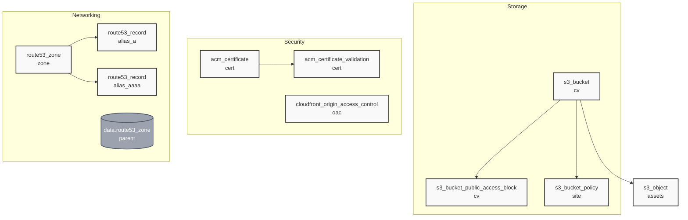

# Static CV Website on cv.prstrnn.cc with Terraform

This Terraform project sets up DNS in **Route 53** for a static website hosted at  
**`cv.prstrnn.cc`**, fronted by **CloudFront**, and secured with an **ACM certificate**.

---

## What it does

- Looks up the parent hosted zone (`prstrnn.cc`) in Route 53.
- Requests an **ACM certificate** for `cv.prstrnn.cc` in **us-east-1** (required for CloudFront).
- Publishes the ACM **DNS validation records** in the parent zone.
- Validates the certificate automatically.
- Creates **A** and **AAAA alias records** in Route 53 for `cv.prstrnn.cc` pointing to the CloudFront distribution.

---

## Simple Graph on how this aligned

